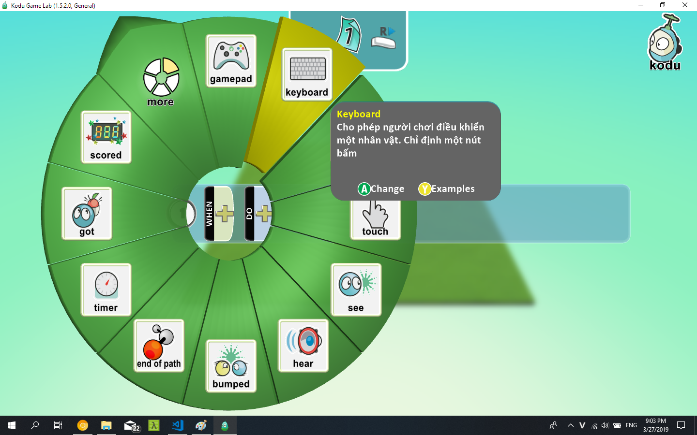

# Cách contribute
- Tạo một branch với username của mình
- Push code của mình lên đó
- Tạo pull request
- Không push lên master
## Cách dịch:
### Thấy chỗ nào giống một câu văn tiếng Anh bình thường (có dấu cách đàng hoàng) thì dịch.
### Dù dịch cái gì cũng phải copy nguyên cái thẻ xml gốc chưa dịch ra, comment bản gốc lại, dịch bản sau, như thế này để tiện proof reading:
```xml
    <!-- <a label="English">English<a> -->
    <a label="Tiếng Việt">Tiếng Việt<a>
```
### Lưu ý:
- `&lt;` `&gt;` là các dấu <, >, giữ nguyên nó
- File [Cards.xml](./VN/Cards.xml): dịch các thẻ kẹp chữ, có tham số `label` (dịch cả `label`)
- File [Help.xml](./VN/Help.xml): dịch các thẻ `description`
- File [TutorialStrings.xml](./VN/TutorialStrings.xml): dịch các thẻ nào có chữ Text
- File [TweakScreenHelp.xml](./VN/TweakScreenHelp.xml): dịch các thẻ `desc`

### Thấy cái gì đó phân vân thì hãy hỏi anh em.

# Những gì tìm hiểu được về cách Kodu xử lý phần ngôn ngữ
- Trong thư mục `C:\Program Files (x86)\Microsoft Research\Kodu Game Lab\Content\Xml\Localizable` chứa một file `Locales.xml` để list các ngôn ngữ và các thư mục chứa ngôn ngữ đó, nhưng không hiểu sao nó không đọc content file này hay sao đấy...
- Khi chọn ngôn ngữ nào đó, nó sử dụng thư mục trong này

# Cách test
- Nhét các thứ trong thư mục `VN` thư mục `C:\Program Files\ ... \Localizable\ES`
- Chạy Kodu, chọn tiếng Tây Ban Nha (Spanish), restart.

# Nhận xét
- Kodu không chịu đọc file `Locales.xml` nên không biết làm như thế nào.

- Cách hơi xấu một chút nhưng đảm bảo an toàn là ghi đè tiếng việt vào một ngôn ngữ khác không ai dùng bao giờ (chắc là cái nào cũng được trừ tiếng Anh) rồi cho học sinh chọn tiếng đó.

- Về lâu dài có thể liên lạc với team dev của Kodu để contribute bản dịch này.

# Demo

